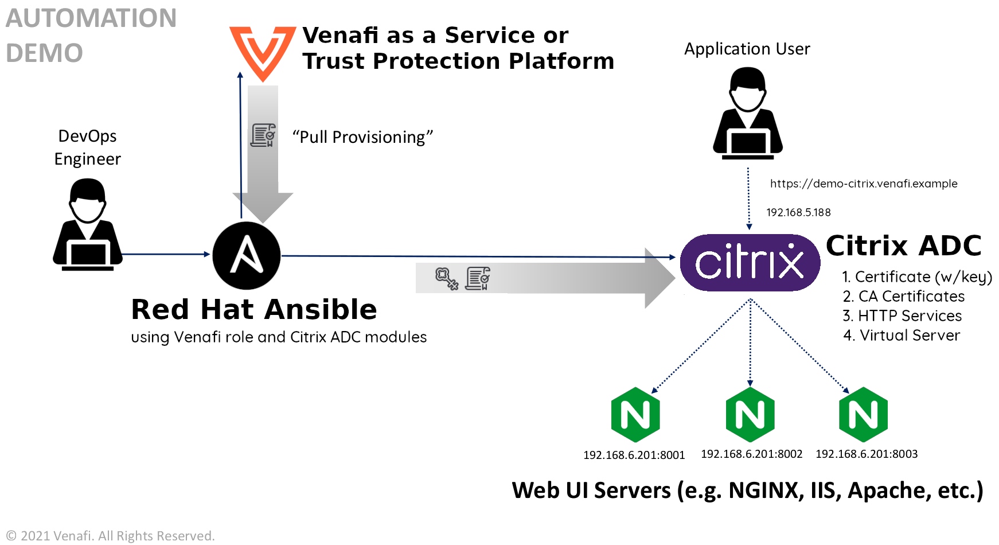

# Configuring secure application delivery using Citrix ADC and the Venafi Ansible Role

In this example, we'll show you how to better secure application delivery using the Venafi Ansible Role with your [Citrix ADC](https://www.citrix.com/products/citrix-adc/) instance.
Adding Venafi enables you to manage certificates more securely as part of the [TLS Termination](https://en.wikipedia.org/wiki/TLS_termination_proxy) process on your load balancer.

## Who should use this example?

The steps described in this document are typically performed by _DevOps engineers_ or _system administrators_. Generally, you'll need a basic undestanding of Citrix ADC, Venafi Trust Protection Platform or Venafi Cloud, and the required permissions for completing the tastks described in the example.

## About this example

An _application delivery controller_ (ADC) is used to increase the capacity and reliability of applications. ADC improves the performance of applications by decreasing the load on associated servers while managing and maintaining application and network sessions. But ADC configuration can become a long process. However, you can actually automate the process by using a configuration management tool.

In this example, we use [RedHat Ansible](https://www.ansible.com/) with the _Venafi Ansible Role_ to automate the process of requesting, retrieving and installing a certificate as part of SSL termination on an ADC (specifically, Citrix ADC) for load balancing web traffic. We'll also utilize three HTTP servers contained in a cluster as the endpoints that are sending and receiving web traffic and being managed by Citrix ADC.

Later in this example, you'll generate a certificate for the `demo-citrix.venafi.example` domain using the Venafi Ansible Role to request and retrieve it from either _Venafi Trust Protection Platform_ or _Venafi Cloud_ services. Then you'll copy the certificate files (certificate, private key, chain Bundle) to the Citrix ADC. Finally, you'll configure Citrix ADC to distribute the traffic between three NGINX servers using the round-robin load balancing method. Here below you can find a diagram of what we are trying to accomplish.

> **NOTE** In our example, we suggest that you use the round-robin balancing method. But keep in mind that there are [other methods](https://docs.citrix.com/en-us/citrix-adc/current-release/load-balancing/load-balancing-customizing-algorithms.html) that might be more suitable for your specific use case.



## Prerequisites

> **BEST PRACTICES** In general, be careful when using self-signed certificates because of the inherent risks of no identity verification or trust control. The public and private keys are both held by the same entity. Also, self-signed certificates cannot be revoked; they can only be replaced. If an attacker has already gained access to a system, the attacker can spoof the identity of the subject. Of course, CAs can revoke a certificate only when they discover the compromise.

To perform the tasks described in this example, you'll need:

- The Venafi Ansible Role installed on your machine; you can install it using `ansible-galaxy` [as described here](https://github.com/Venafi/ansible-role-venafi#using-with-ansible-galaxy)
- Access to either Venafi Trust Protection Platform or Venafi Cloud services (the `credentials.yml` [file](https://github.com/Venafi/ansible-role-venafi#using-with-ansible-galaxy) is used in this example)
  - If you are working with Trust Protection Platform, obtain the `access_token` and `refresh_token` using the [VCert CLI](https://github.com/Venafi/vcert/blob/master/README-CLI-PLATFORM.md#obtaining-an-authorization-token).
- Administration access to a Citrix ADC instance
- Nitro Python SDK (available from https://www.citrix.com/downloads/netscaler-adc or from the _Downloads_ tab of the Citrix ADC GUI)
- Citrix ADC modules for Ansible installed from `ansible-galaxy` (for installation instructions, see [this guide](https://github.com/citrix/citrix-adc-ansible-modules#installation))
- A set of three (3) NGINX servers running your application

## Getting started

Here are the steps we'll complete as we go through this example:

1. Retrieve a certificate using the Venafi Ansible Role
2. Copy the retrieved certificate files to Citrix ADC
3. Create a certificate-key pair on Citrix ADC 
4. Create HTTP back-end services on Citrix ADC
5. Create a virtual server on Citrix ADC
6. Execute the playbook

## Step 1: Retrieve a certificate using the Venafi Ansible Role

### Step 1a: Creating variables file

The first step is to create the `variables.yaml` file, in this file are defined the variables used during the execution of the playbook such as:

- The Citrix ADC management IP address.
- The credentials used to manage the Citrix ADC.
- The CN needed to generate the certificate.
- The Virtual IP and port on which all the HTTPS traffic will be handled.
- The http services (the NGINX servers running the application).
- The name for the certificate files which will be copied to the Citrix ADC. 

```yaml

adc_address: "192.168.5.188"
adc_username: "youruser"
adc_password: "yourpassword"

test_site:
  name: "demo-citrix"
  domain: "venafi.example"

adc_virtual_ip: "192.168.3.167"
adc_virtual_port: "443"

http_service: 192.168.6.201
port1: 8001
port2: 8002
port3: 8003
    
cert_name: "{{ test_site.name }}.crt"
key_name: "{{ test_site.name }}.key"
chain_name: "{{ test_site.name }}-ca-bundle.crt"
```

### Step 1b: Creating the playbook

Start by creating a YAML file named `citrix_create_playbook.yaml`, inside, define a name for the playbook, the hosts in which the tasks will be executed, the type of connection to use, the Citrix ADC collection and specify the variables file created in the previous step :

```yaml
- name: Create Critx ADC Application
  hosts: localhost
  connection: local
  collections: citrix.adc

  vars_files:
    - variables.yaml
```


### Step 1c: Requesting and retrieving the certificate using Venafi Role

In the following block of instructions the Venafi Ansible Role is being specified along with the variables it needs to request and retrieve the certificate from the Venafi services, by adding these instructions the Ansible Role will:

- Request and retrieve a certificate which common and alternate names are `demo-citrix.venafi.example`.
- Create a RSA private key of a size of 2048 bits.
- Generate a chain bundle file where the CA certificate will be place at the end of the file.
- Create a `tmp` directory on the current working directory which will store the retrieved certificate files.
  - 3 files will be retrieved and stored using the names on the variables file (*demo-citrix.{crt,key,-ca-bundle.crt}*).
- Simulate the copy of the retrieved files to the remote host by generating a duplicate of them adding the `.remote` extension (the certificate files retrieved are going to be copied to the Citrix ADC using the Citrix ADC Ansible modules that's the reason why the options `certificate_copy_private_key_to_remote` and `certificate_remote_execution` are set to `false`).


```yaml
---

  roles:
    - role: venafi.ansible_role_venafi

      certificate_common_name: "{{ test_site.name }}.{{ test_site.domain }}"
      certificate_alt_name: "DNS:{{ test_site.name }}.{{ test_site.domain }}"
      certificate_privatekey_type: "RSA"
      certificate_privatekey_size: "2048"
      certificate_chain_option: "last"

      certificate_cert_dir: "./tmp"
      certificate_cert_path: "./tmp/{{ cert_name }}"
      certificate_chain_path: "./tmp/{{ chain_name }}"
      certificate_privatekey_path: "./tmp/{{ key_name }}"
      certificate_copy_private_key_to_remote: false

      certificate_remote_execution: false
      certificate_remote_privatekey_path: "./tmp/{{ key_name }}.remote"
      certificate_remote_cert_path: "./tmp/{{ cert_name }}.remote"
      certificate_remote_chain_path: "./tmp/{{ chain_name }}.remote"
```

## Step 2: Copy the retrieved certificate files to Citrix ADC

By adding the following instructions to the playbook, we specify the actions the playbook will execute. Ansible will connect to the Citrix ADC (using the credentials specified in the variables file) and then it will create the key, CA bundle and certificate using the local files retrieved in the previous step.

```yaml
---

  tasks:
    - name: Copy Private Key to Citrix ADC {{ adc_address }}
      citrix_adc_system_file:
        nsip: "{{ adc_address }}"
        nitro_user: "{{ adc_username }}"
        nitro_pass: "{{ adc_password }}"
        nitro_protocol: http
        validate_certs: false
        state: present
        filename: "{{ key_name }}"
        filelocation: "/nsconfig/ssl/"
        filecontent: "{{ lookup('file', './tmp/' + key_name) }}"
      delegate_to: localhost

    - name: Copy Certificate to Citrix ADC {{ adc_address }}
      citrix_adc_system_file:
        nsip: "{{ adc_address }}"
        nitro_user: "{{ adc_username }}"
        nitro_pass: "{{ adc_password }}"
        nitro_protocol: http
        validate_certs: false
        state: present
        filename: "{{ cert_name }}"
        filelocation: "/nsconfig/ssl/"
        filecontent: "{{ lookup('file', './tmp/' + cert_name + '.remote') }}"
      delegate_to: localhost

    - name: Copy CA Bundle to Citrix ADC {{ adc_address }}
      citrix_adc_system_file:
        nsip: "{{ adc_address }}"
        nitro_user: "{{ adc_username }}"
        nitro_pass: "{{ adc_password }}"
        nitro_protocol: http
        validate_certs: false
        state: present
        filename: "{{ chain_name }}"
        filelocation: "/nsconfig/ssl"
        filecontent: "{{ lookup('file', './tmp/' + chain_name + '.remote') }}"
      delegate_to: localhost

```

## Step 3: Create a certificate-key pair on Citrix ADC

To be able to handle the HTTPS requests, Ansible needs to create a cert-key pair on the Citrix ADC using the files you copied in the previous step. 
```yaml
---

    - name: Create Certkey on Citrix ADC {{ adc_address }}
      citrix_adc_ssl_certkey:
        nsip: "{{ adc_address }}"
        nitro_user: "{{ adc_username }}"
        nitro_pass: "{{ adc_password }}"
        nitro_protocol: http
        validate_certs: false
        state: present
        certkey: "{{ test_site.name }}.{{ test_site.domain }}_certkey"
        cert: "/nsconfig/ssl/{{ cert_name }}"
        key: "/nsconfig/ssl/{{ key_name }}"
```

## Step 4: Create HTTP back-end services on Citrix ADC

After you create the cert-key pair on the Citrix ADC, Ansible needs to create the HTTP services on the Citric ADC instance. These services are the ones that will actually serve the requests (NGINX servers hosting the application). Ansible will use the host and port variables defined in the variables file for each service. 

```yaml
---

    - name: Create service-http-1 on Citrix ADC {{ adc_address }}
      citrix_adc_service:
        nsip: "{{ adc_address }}"
        nitro_user: "{{ adc_username }}"
        nitro_pass: "{{ adc_password }}"
        nitro_protocol: http
        validate_certs: false
        state: present
        name: service-http-1
        servicetype: HTTP
        ip: "{{ http_service }}"
        ipaddress: "{{ http_service }}"
        port: "{{ port1 }}"
      delegate_to: localhost

    - name: Create service-http-2 on Citrix ADC {{ adc_address }}
      citrix_adc_service:
        nsip: "{{ adc_address }}"
        nitro_user: "{{ adc_username }}"
        nitro_pass: "{{ adc_password }}"
        nitro_protocol: http
        validate_certs: false
        state: present
        name: service-http-2
        servicetype: HTTP
        ip: "{{ http_service }}"
        ipaddress: "{{ http_service }}"
        port: "{{ port2 }}"
      delegate_to: localhost

    - name: Create service-http-3 on Citrix ADC {{ adc_address }}
      citrix_adc_service:
        nsip: "{{ adc_address }}"
        nitro_user: "{{ adc_username }}"
        nitro_pass: "{{ adc_password }}"
        nitro_protocol: http
        validate_certs: false
        state: present
        name: service-http-3
        servicetype: HTTP
        ip: "{{ http_service }}"
        ipaddress: "{{ http_service }}"
        port: "{{ port3 }}"
      delegate_to: localhost
```

## Step 5: Create a virtual server on Citrix ADC

Now that HTTP services have been created, Ansible must create a virtual IP address in order to send the external requests to the HTTP back-end services. The following task creates the virtual server and assigns it the virtual IP defined in the variables file, the port, the certificate-key pair and the HTTP services previously created, as well as the round-robin load balancing [method](https://docs.citrix.com/en-us/citrix-adc/current-release/load-balancing/load-balancing-customizing-algorithms.html) which will allow the virtual server to distribute the load between the NGINX servers hosting the application.

```yaml
---

    - name: Create lb vserver on Citrix ADC {{ adc_address }}
      citrix_adc_lb_vserver:
        nsip: "{{ adc_address }}"
        nitro_user: "{{ adc_username }}"
        nitro_pass: "{{ adc_password }}"
        nitro_protocol: http
        validate_certs: false
        state: present
        name: "vs-{{ test_site.name }}.{{ test_site.domain }}" 
        servicetype: SSL
        timeout: 2
        ipv46: "{{ adc_virtual_ip }}"
        port: "{{ adc_virtual_port }}"
        lbmethod: ROUNDROBIN
        ssl_certkey: "{{ test_site.name }}.{{ test_site.domain }}_certkey" 
        servicebindings:
          - servicename: service-http-1
            weight: 80
          - servicename: service-http-2
            weight: 60
          - servicename: service-http-3
            weight: 40
        disabled: no
      delegate_to: localhost

```

## Step 6: Executing the playbook

After you finish the [playbook](citrix_create_playbook.yaml), use the following command to run it:

```bash
ansible-playbook citrix_create_playbook.yaml --ask-vault-pass
```

If done correctly, you should see output similar to the following: 

[](https://asciinema.org/a/d9BlbbXWGNFcSzQUkIAeJ0Qcr)

## Reversing the changes performed

In this example, we include a [playbook that lets you revert the changes made by running citrix_create_playbook.yaml](citrix_delete_playbook.yaml). Use the following command to run it:

```bash
ansible-playbook citrix_delete_playbook.yaml
```
