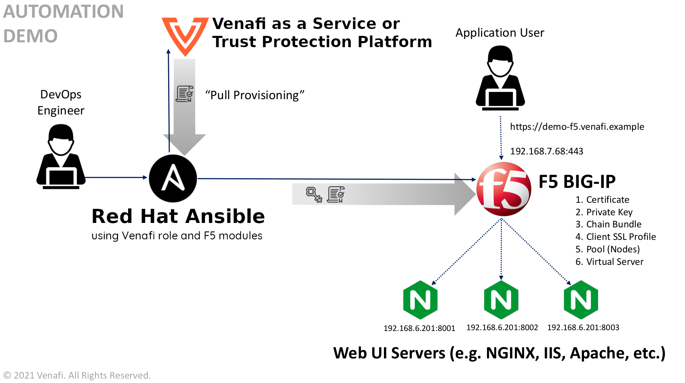

# Configuring secure application delivery using F5 BIG-IP and the Venafi Ansible Role

In this example, we'll show you how to better secure application delivery using the Venafi Ansible Role with your [F5 BIG-IP](https://www.f5.com/products/big-ip-services) instance.
Adding Venafi enables you to manage certificates more securely as part of the [TLS termination](https://www.f5.com/services/resources/glossary/ssl-termination) process on your load balancer.

## Who should use this example?

The steps described in this document are typically performed by a _DevOps engineers_ or a _system administrators_. Generally, you'll need a basic undestanding of F5 BIG-IP, Venafi Trust Protection Platform or Venafi Cloud, and the required permissions for completing the tasks described in the example.

## About this example

An _application delivery controller_ (ADC) is used to increase capacity and reliability of applications. ADC improves the performance of applications by decreasing the load on associated servers while managing and maintaining application and network sessions. But ADC configuration can become a lengthy process. However, you can actually automate the process by using a configuration management tool.

In this example we use [RedHat Ansible](https://www.ansible.com/) with the _Venafi Ansible Role_ to automate the process of requesting, retrieving and installing a certificate as part of SSL termination on an ADC (specifically, F5 BIG-IP) for load balancing web traffic. We'll also utilize three HTTP servers contained in a cluster as the endpoints that are sending and receiving web traffic and being managed by F5 BIG-IP.

Later in this example, you'll generate a certificate for the `demo-f5.venafi.example` domain using the Venafi Ansible Role to request and retrieve it from either _Venafi Trust Protection Platform_ or _Venafi Cloud_ services. Then you'll copy the certificate files (certificate, private key, chain bundle) to the F5 BIG-IP. Finally, you'll configure F5 BIG-IP to distribute the traffic between three HTTP servers using the round-robin load balancing method. Take a look at the diagram below for an overview of what we're going to create.

> **NOTE** In our example, we suggest that you use the round-robin balancing method. But keep in mind that there are [other methods](https://www.f5.com/services/resources/glossary/load-balancer) that might be more suitable for your specific use case.



## Prerequisites

To perform the tasks described in this example, you'll need:

- The Venafi Ansible Role installed on your machine, you can install it using `ansible-galaxy` [as described here](https://github.com/Venafi/ansible-role-venafi#using-with-ansible-galaxy)
- Access to either **Venafi Trust Protection Platform** or **Venafi Cloud** services (the `credentials.yml` [file](https://github.com/Venafi/ansible-role-venafi#using-with-ansible-galaxy) is used in this example).
  - If you are working with **Venafi Trust Protection Platform** obtain the `access_token` and `refresh_token` using the [VCert CLI](https://github.com/Venafi/vcert/blob/master/README-CLI-PLATFORM.md#obtaining-an-authorization-token).
- Administration access to the F5 BIG-IP instance. 
- A set of 3 HTTP servers running your application.

## Getting started

Here are the steps we'll take as we go trough this example:

1. Retrieve a certificate using the Venafi Ansible Role
2. Copy the retrieved certificate files to F5 BIG-IP
3. Create a Client SSL Profile on F5 BIG-IP
4. Create Pool on F5 BIG-IP
5. Add pool members on F5 BIG-IP
6. Create a virtual server on F5 BIG-IP
7. Execute the playbook

> **NOTE** Credentials used in this example are for demonstration purposes only. You should use stronger credentials. 

> **BEST PRACTICES** In general, be careful when using self-signed certificates because of the inherent risks of no identity verification or trust control. The public and private keys are both held by the same entity. Also, self-signed certificates cannot be revoked; they can only be replaced. If an attacker has already gained access to a system, the attacker can spoof the identity of the subject. Of course, CAs can revoke a certificate only when they discover the compromise.

## Step 1: Retrieve a certificate using Venafi Ansible Role

### Step 1a: Creating variables file

The first step is to create the `variables.yaml` file. This file defines the variables used during the execution of the playbook, which include:

- The F5 BIG-IP management IP address
- The credentials used to manage the F5 BIG-IP
- The CN needed to generate the certificate
- The partition in which all the information will be stored
- The Virtual IP and port on which all the HTTPS traffic will be handled
- The pool members (the NGINX servers running the application)
- The name for the certificate files that will be copied to the F5 BIG-IP
- To facilitate the connection with the device, the connection parameters can be also specified in this file.
  - The pattern used for this is called a _provider_; the provider is a dictionary that includes sub-keys such as *password*, *server*, etc.
  - In the following steps, the provider dictionary will be passed as a parameter to the tasks so that they can connect to the F5 BIG-IP.

```yaml
f5_address: "yourf5bigip"
f5_username: "youruser"
f5_password: "yourpassword"

test_site:
  name: "demo-f5"
  domain: "venafi.example"

f5_partition: "Demo" 
f5_virtual_ip: "192.168.7.68"
f5_virtual_port: "443"
f5_pool_members: 
  - host: 192.168.6.201
    port: 8001
  - host: 192.168.6.201
    port: 8002
  - host: 192.168.6.201 
    port: 8003

cert_name: "{{ test_site.name }}.crt"
key_name: "{{ test_site.name }}.key"
chain_name: "{{ test_site.name }}-ca-bundle.crt"

f5_provider:
  server: "{{ f5_address }}"
  server_port: 443
  user: "{{ f5_username }}"
  password: "{{ f5_password }}"
  validate_certs: no
```

### Step 1b: Creating the playbook

Start by creating a YAML file named `f5_create_playbook.yaml`, inside, define a name for the playbook, the hosts in which the tasks will be executed, the type of connection to use and specify the variables file created in the previous step :

```yaml
- name: Create F5 Application
  hosts: localhost
  connection: local

  vars_files:
    - variables.yaml
```

### Step 1c: Requesting and retrieving the certificate using Venafi Role

In the following block of instructions the Venafi Ansible Role is being specified along with the variables it needs to request and retrieve the certificate from the Venafi services, by adding these instructions the Ansible will:

- Request and retrieve a certificate which common and alternate names are `demo-f5.venafi.example`.
- Create a RSA private key of a size of 2048 bits.
- Generate a chain bundle file where the CA certificate will be place at the end of the file.
- Create a `tmp` directory on the current working directory which will store the retrieved certificate files.
  - 3 files will be retrieved and stored using the names on the variables file (*demonstration.{crt,key,-ca-bundle.crt}*).
- Simulate the copy of the retrieved files to the remote host by generating a duplicate of them adding the `.remote` extension (the certificate files retrieved are going to be copied to F5 BIG-IP using the F5 Ansible modules that's the reason why the options `certificate_copy_private_key_to_remote` and `certificate_remote_execution` are set to `false`).


```yaml
---

  roles:
    - role: venafi.ansible_role_venafi

      certificate_common_name: "{{ test_site.name }}.{{ test_site.domain }}"
      certificate_alt_name: "DNS:{{ test_site.name }}.{{ test_site.domain }}"
      certificate_privatekey_type: "RSA"
      certificate_privatekey_size: "2048"
      certificate_chain_option: "last"

      certificate_cert_dir: "./tmp"
      certificate_cert_path: "./tmp/{{ cert_name }}"
      certificate_chain_path: "./tmp/{{ chain_name }}"
      certificate_privatekey_path: "./tmp/{{ key_name }}"
      certificate_copy_private_key_to_remote: false

      certificate_remote_execution: false
      certificate_remote_privatekey_path: "/tmp/{{ key_name }}.remote"
      certificate_remote_cert_path: "/tmp/{{ cert_name }}.remote"
      certificate_remote_chain_path: "/tmp/{{ chan_name }}.remote"
```

## Step 2: Copy the retrieved certificate files to F5 BIG-IP

By adding the instructions below to the playbook, we specify the actions the playbook will execute. Ansible will connect to the F5 BIG-IP (using the credentials specified in the provider dictionary) and then it will create the key, CA bundle and certificate using the local files retrieved in the previous step.


```yaml
---

  tasks:
    - name: Create Private Key on F5 BIG-IP {{ f5_address }}
      bigip_ssl_key:
        state: present
        provider: "{{ f5_provider }}"
        name: "{{ key_name }}"
        partition: "{{ f5_partition }}"
        content: "{{ lookup('file', './tmp/' + key_name) }}"
      delegate_to: localhost

    - name: Create Certificate on F5 BIG-IP {{ f5_address }}
      bigip_ssl_certificate:
        state: present
        provider: "{{ f5_provider }}"
        name: "{{ cert_name }}"
        partition: "{{ f5_partition }}"
        content: "{{ lookup('file', './tmp/' + cert_name + '.remote') }}"
      delegate_to: localhost

    - name: Create CA Bundle on F5 BIG-IP {{ f5_address }}
      bigip_ssl_certificate:
        state: present
        provider: "{{ f5_provider }}"
        name: "{{ chain_name }}"
        partition: "{{ f5_partition }}"
        content: "{{ lookup('file', './tmp/' + chain_name + '.remote') }}"
      delegate_to: localhost

```

## Step 3: Create a Client SSL Profile on F5 BIG-IP

After copying the certificate files to the F5 BIG-IP, we need to specify where those files will be used. You can do this by adding `Client SSL profile`, which enables the F5 BIG-IP system to accept and terminate client requests that are using SSL. And once again, we're specifying the credentials used to execute this task on the F5 instance, as well as specifying the certificate files to use.

```yaml
---
    - name: Create Client SSL Profile on F5 BIG-IP {{ f5_address }}
      bigip_profile_client_ssl:
        state: present
        provider: "{{ f5_provider }}"
        name: "clientssl_{{ test_site.name }}"
        partition: "{{ f5_partition }}"
        parent: "clientssl"
        cert_key_chain:
        - cert: "{{ cert_name }}"
          key: "{{ key_name }}"
          chain: "{{ chain_name }}"
      delegate_to: localhost
```

## Step 4: Create a Pool on F5 BIG-IP

The next step is to add a pool, which is a collection of resources to which F5 will distribute the requests. This provides load balancing [functionality](https://www.f5.com/services/resources/glossary/load-balancer) by using the [round-robin](https://en.wikipedia.org/wiki/Round-robin_scheduling) method. In this case the members of the pool are the NGINX servers defined in the variables file.

```yaml
---

    - name: Create Pool on F5 BIG-IP {{ f5_address }}
      bigip_pool:
        state: present
        provider: "{{ f5_provider }}"
        name: "pool_{{ test_site.name }}"
        partition: "{{ f5_partition }}"
        lb_method: round-robin
      delegate_to: localhost
```

## Step 5: Add Pool members on F5 BIG-IP

Once the pool is created, Ansible needs to create the pool member in the F5 BIG-IP instance. The members actually serve the requests (NGINX servers hosting the application). Ansible will use the host and port variables defined in the variables file for each one of the pool members defined in the `f5_pool_members` dictionary. 

```yaml
---

    - name: Add Pool Members on F5 BIG-IP {{ f5_address }}
      bigip_pool_member:
        state: present
        provider: "{{ f5_provider }}"
        partition: "{{ f5_partition }}"
        host: "{{ item.host }}"
        port: "{{ item.port }}"
        pool: "pool_{{ test_site.name }}"
      with_items: "{{ f5_pool_members }}"
      delegate_to: localhost
```

## Step 6: Create a virtual server on F5 BIG-IP

Now that the pool and the nodes are members of the pool, Ansible has to create a virtual IP address in order to send the external requests to pool members. The following task creates the virtual server and assigns it the virtual IP defined in the variables files, as well as the port and Client SSL profile created previously.

```yaml
---

    - name: Create Virtual Server on F5 BIG-IP {{ f5_address }}
      bigip_virtual_server:
        state: present
        provider: "{{ f5_provider }}"
        name: "vs_{{ test_site.name }}"
        partition: "{{ f5_partition }}"
        description: "Provisioned by Ansible"
        destination: "{{ f5_virtual_ip }}"
        port: "{{ f5_virtual_port }}"
        snat: Automap
        pool: "pool_{{ test_site.name }}"
        profiles:
          - "clientssl_{{ test_site.name }}"
      delegate_to: localhost
```

## Step 7: Execute the playbook

After you finish the [playbook](f5_create_playbook.yaml), use the following command to run it:

```bash
ansible-playbook f5_create_playbook.yaml --ask-vault-pass
```

If done correctly, you should see output similar to the following:

[](https://asciinema.org/a/ff3Ulbvvr6XdP8XTn4gbCFLyy)

## Reversing the changes performed

In this example, we include a [playbook that lets you revert the changes made by running f5_create_playbook.yaml](f5_delete_playbook.yaml). Use the following command to run it:

```bash
ansible-playbook f5_delete_playbook.yaml
```
