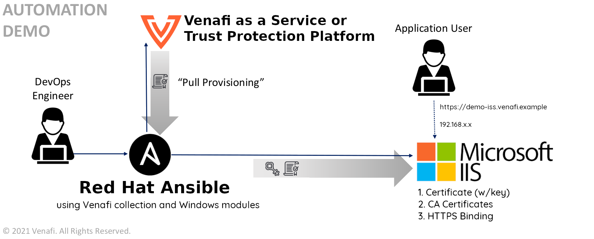

# Configuring secure web applications using Microsoft IIS and the Venafi Collection for Ansible

In this example, we'll show you how to better secure the communication between your [Microsoft Internet Information Services](https://www.iis.net) (IIS) application and its users by using the *Venafi Collection for Ansible*.
 Adding CyberArk enables you to automate certificate management and enable the TLS protocol on your web server.

## Who should use this example?

The steps described in this document are typically performed by _DevOps engineers_ or _system administrators_. Generally, you'll need a basic undestanding of IIS, CyberArk Certificate Manager, Self-Hosted or CyberArk Certificate Manager, SaaS, and the required permissions for completing the tasks described in the example.

## About this example


In this Infrastructure as Code example we use [RedHat Ansible](https://www.ansible.com/) with the _Venafi Collection for Ansible_ to automate the process of requesting, retrieving and installing a certificate as part of enabling the TLS protocol for an IIS server.

Later in this example, you'll generate a certificate for `demo-iis.venafi.example` using Ansible and the `venafi.machine_identity.certificate` role to request and retrieve it from either _CyberArk Certificate Manager, Self-Hosted_ or _CyberArk Certificate Manager, SaaS_. Then you'll create a [PKCS#12](https://en.wikipedia.org/wiki/PKCS_12) file using the certificate and private key retrieved from CyberArk, copy it to the target Windows server and then import it into the certificate store. Finally, you'll configure IIS to use the certificate for HTTPS. Take a look at the diagram below for an overview of what we're going to create.



## Prerequisites

To perform the tasks described in this example, you'll need:

- A server running Windows Server 2016 (or higher) with:
  - IIS installed and a web site created without an HTTPS binding.
  - WinRM access over HTTPS and NTLM authentication enabled [as described here](https://docs.ansible.com/ansible/latest/user_guide/windows_setup.html).
  - A user account that has administrative access.
- A Linux system with:
  - Red Hat Ansible installed [as described here](https://docs.ansible.com/ansible/latest/installation_guide/intro_installation.html).
  - The *Venafi Collection for Ansible* installed using `ansible-galaxy` [as described here](https://github.com/Venafi/ansible-collection-venafi/blob/main/roles/certificate/README.md#using-with-ansible-galaxy).
- Access to request certificates from either **CyberArk Certificate Manager, Self-Hosted** or **CyberArk Certificate Manager, SaaS** (the `credentials.yml` [file](https://github.com/Venafi/ansible-collection-venafi/blob/main/roles/certificate/README.md#using-with-ansible-galaxy) is used in this example).
  - If you are working with **CyberArk Certificate Manager, Self-Hosted** obtain the `access_token` using the [VCert CLI](https://github.com/Venafi/vcert/blob/master/README-CLI-PLATFORM.md#obtaining-an-authorization-token).
  - Administration access to the Microsoft Windows Server Operating System.

## Getting started

Here are the steps we'll take as we go trough this example:

1. Create a `variables.yaml` file to specify the details of the certificate to request and IIS configuration
2. Create a `hosts` file to specify the target systems and methods Ansible will use when executing tasks
3. Create a `credentials.yml` file to specify how to connect to CyberArk
4. Create a `iis_create_playbook.yaml` file that does the following:
   1. Request and retrieve a certificate using the Venafi Collection for Ansible
   2. Create a PKCS#12 file using the generated private key and certificate files
   3. Copy the PKCS#12 file to your Windows server machine
   4. Import the certificate to the Windows certificate store
   5. Add a HTTPS binding to IIS that uses the certificate 
5. Execute the playbook

All files are available for download and unless you want different behavior than this example, only the `hosts` , `variables.yaml`, and `credentials.yml` require editing.

> **NOTE** Credentials used in this example are for demonstration purposes only. You should use stronger credentials. 

### Variables File

The `variables.yaml` file defines the variables used during the execution of the playbook, which include:

- The Common Name (CN) of the certificate to request for the IIS web site.
- The name of the IIS web site (required for the creation of the HTTPS binding).
- The IP address of the IIS binding.
- The TCP port of the IIS binding (e.g. 443).
- The SNI flag indicating if the variable isn't defined it would indicate no SNI (no host header), if it is defined and false it would indicate optional SNI (host header & SSL flag=0), if it is defined and true it would indicate required SNI (host header & SSL Flags=1).
- The passphrase for the PKCS#12 file used to securely transmit the certificate from Ansible to the certificate store on the target Windows server  (if this variable is not defined, a value of `v3Naf1!` is used by default)
- The name for the certificate files that will be copied to the target Windows server.

```yaml
my_site:
  name: "demo-iis"
  domain: "venafi.example"

iis_site_name: "Default Web Site"
iis_bind_ip: 192.168.2.162
iis_bind_port: 443
iis_sni: true
iis_p12_pass: "v3Naf1!"

cert_path: "/tmp/etc/ssl"
cert_name: "{{ my_site.name }}.{{ my_site.domain }}"
```

### Inventory File

The `hosts` file is a standard Ansible construct that defines the servers it will manage. This file contains information about the servers, which includes:

- The DNS resolvable Windows server FQDN that matches the Common Name (CN) of the server's WinRM server certificate.
- The credentials used to connect to the Windows server machine.  These can be either local or domain if NTLMv2 authentication is used.
- The type of connection Ansible will use to access to the server.  Using WinRM over HTTPS (default port 5986) with NTLMv2 is recommended for being the best combination of simplicity and security.

```yaml
[win]
my-windows-server.example.com

[win:vars]
ansible_user=yourUser
ansible_password=yourPassword
ansible_connection=winrm
ansible_port=5986
ansible_winrm_transport=ntlm
ansible_winrm_scheme=https
ansible_winrm_server_cert_validation=validate
ansible_winrm_ca_trust_path=/path-to/trust-bundle.pem
```

> **NOTE**: Credentials used in this example are for demonstration purposes only. You should use stronger credentials. 

### CyberArk Credentials File

The *Venafi Collection for Ansible* requires CyberArk credentials and connection settings to be specified using a file called `credentials.yml`.  Once created we recommend applying password-based encryption to it using `ansible-vault encrypt credentials.yml`.

**CyberArk Certificate Manager, Self-Hosted**:

```
access_token: 'p0WTt3sDPbzm2BDIkoJROQ=='
url: 'https://tpp.venafi.example'
zone: "DevOps\\Ansible"
trust_bundle: "/path/to/bundle.pem"
```

**CyberArk Certificate Manager, SaaS**:

```
token: 'xxxxxxxx-xxxx-xxxx-xxxx-xxxxxxxxxxxx'
zone: 'Business App\\Enterprise CIT'
```

> **NOTE**: Credentials used in this example are for demonstration purposes only. You should use stronger credentials. 

### Creating the Playbook

Start by creating a YAML file named `iis_create_playbook.yaml`. Inside, define a name for the playbook, the hosts in which the tasks will be executed, the collection that will be used, and specify the variables file created in the previous step:

```yaml
---
- name: Generate and Install cert on IIS
  hosts: all
  collections: venafi.machine_identity

  vars_files:
    - variables.yml
```

#### Requesting and retrieving the certificate using the CyberArk Certificate Role


In the following block of instructions the CyberArk Certificate Role is being specified along with the variables it needs to request and retrieve the certificate from the CyberArk services, by adding these instructions the Ansible will:

- Request and retrieve a certificate which common and alternate names are `demo-iis.venafi.example`.
- Create a RSA private key of a size of 2048 bits.
- Generate a chain bundle file where the CA certificate will be place at the end of the file.
- Use the `cert_path` variable from the variables file to store the retrieved certificate files.
  - 3 files will be retrieved and stored using the names on the variables file (*demo-iis.{pem,key,chain.pem}*).
- Simulate the copy of the retrieved files to the remote host by generating a duplicate of them adding the `.remote` extension (the certificate files retrieved are going to be use to create a PKCS12 file which will be sent to the Windows Server machine using the Windows Ansible modules that's the reason why the options `certificate_copy_private_key_to_remote` and `certificate_remote_execution` are set to `false`).


```yaml
    - name: Calling Venafi Certificate role
      include_role:
        name: certificate
        apply:
          delegate_to: localhost
      vars:
        certificate_common_name: "{{ cert_name }}"
        certificate_alt_name: "DNS:{{ cert_name }}"
        certificate_copy_private_key_to_remote: false
        certificate_privatekey_type: "RSA"
        certificate_privatekey_size: "2048"
        certificate_chain_option: "last"
        certificate_cert_dir: "{{ cert_path }}/{{ cert_name }}"
        certificate_remote_execution: false
        certificate_remote_cert_path: "{{ cert_path }}/{{ cert_name }}.pem.remote"
        certificate_remote_privatekey_path: "{{ cert_path }}/{{ cert_name }}.key.remote"
        certificate_remote_chain_path: "{{ cert_path }}/{{ cert_name }}.chain.pem.remote"
```

#### Generate PKCS#12 file 

In the `Generate PKCS#12 file` task of the `iis_create_playbook.yaml` file we specify the actions Ansible will execute, allowing it to locally create a PKCS#12 file (the format required by IIS), using the private key and certificate files obtained with the execution of the CyberArk Certificate Role.

#### Copy PKCS#12 file to the Windows Server

By executing the `Copy Cert Files` task Ansible will connect to the remote Windows server (using the credentials specified in the inventory file) and then copy the PKCS#12 file to the user's home directory (as specified by the`%HOMEPATH%` environment variable).

#### Import PKCS#12 file into the Windows certificate store

After copying the PKCS#12 file to the Windows server, we need to add it to the Windows certificate store so it can be used by IIS.  This is performed with the `Import PKCS#12 to certificate Store` task which returns the value of the certificate thumbprint which will use in the next task.

#### Create a HTTPS binding

The next step is to create a HTTPS binding on the IIS web server by using the thumbprint value (returned by the previous task), to specify the certificate we want to use (from the Windows certificate store), the name of the IIS web site, the protocol, IP address and port (the `Add HTTPS a binding SNI` task will be executed by Ansible if the `iis_sni` variable is defined in the variables file; if it is not, the `Add a HTTPS binding` task will be executed).

Click [here](iis_create_playbook.yaml) to download a complete `iis_create_playbook.yaml` example file.

### Execute the playbook

After you finish the [playbook](iis_create_playbook.yaml), use the following command to run it:

```bash
ansible-playbook -i hosts iis_create_playbook.yaml --ask-vault-pass
```


### Reversing the changes performed

In this example, we include a [playbook that lets you revert the changes made by running iis_create_playbook.yaml](iis_delete_playbook.yaml). Use the following command to run it:

```bash
ansible-playbook -i hosts iis_delete_playbook.yaml
```
